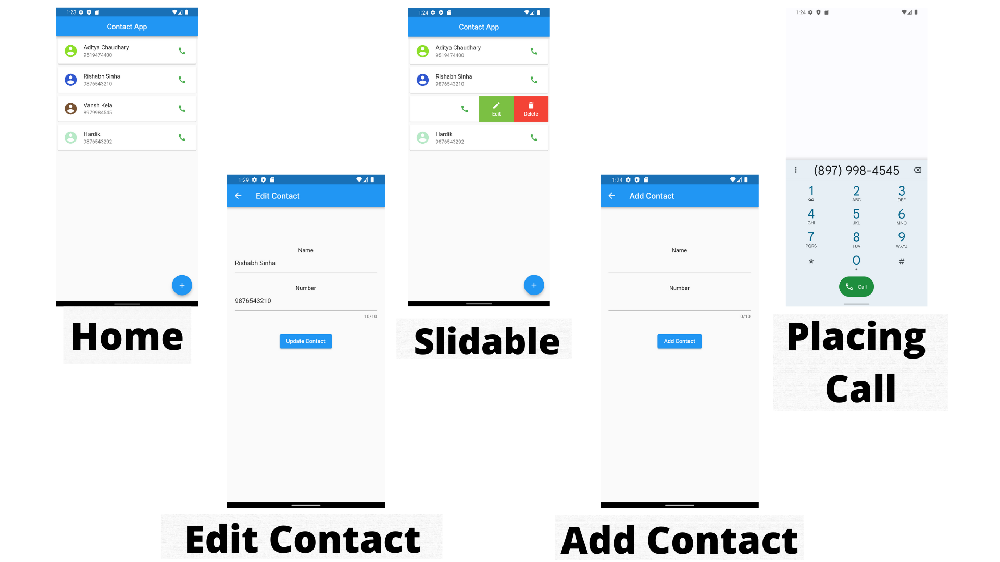

# Contacts
## _The Contact App_

Contacts is a flutter app that can be used across multiple platforms. It is connected to firebase which allows it to fetch data from the internet without copying contacts from one device to another. It allows user to edit, create or delete contacts directly from the application.

Here are the key features in detail:
⭐ Call user directly from app
⭐ Easy to use UI
⭐ Edit or delete contacts
⭐ Create contacts

## Tech

## Plugins
- Cupertino_icons: ^1.0.2
- Flutter_slidable: ^1.2.0
- Cloud_firestore: ^3.1.10
- Firebase_core: ^1.13.1
- Url_launcher: ^6.0.20
## Getting Started

This project is a starting point for a Flutter application.

A few resources to get you started if this is your first Flutter project:

- [Lab: Write your first Flutter app](https://flutter.dev/docs/get-started/codelab)
- [Cookbook: Useful Flutter samples](https://flutter.dev/docs/cookbook)

For help getting started with Flutter, view our
[online documentation](https://flutter.dev/docs), which offers tutorials,
samples, guidance on mobile development, and a full API reference.

### Screenshots 📱
